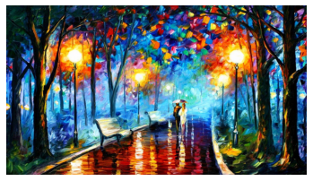
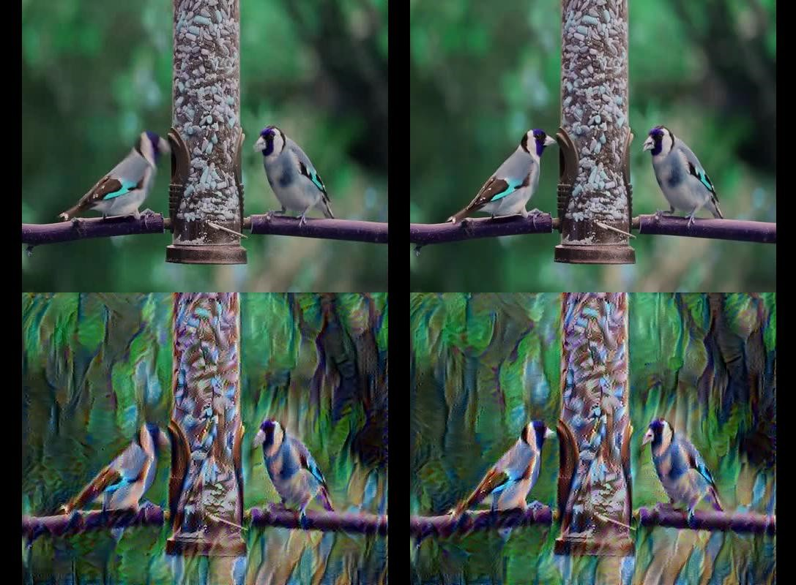

# Style Transfer GANs
The repository impliments style transfer GAN architecture on videos using Transfer Learning on VGG-19 architecture. 

## How to run this notebook
To run the notebook, upload it to a kaggle envoirnment and load the dataset in /input/ directory

## Results
The following artistic image was applied on the video. A sample video frame is shown below

### Artistic Image

### Resulting Style Transfer

